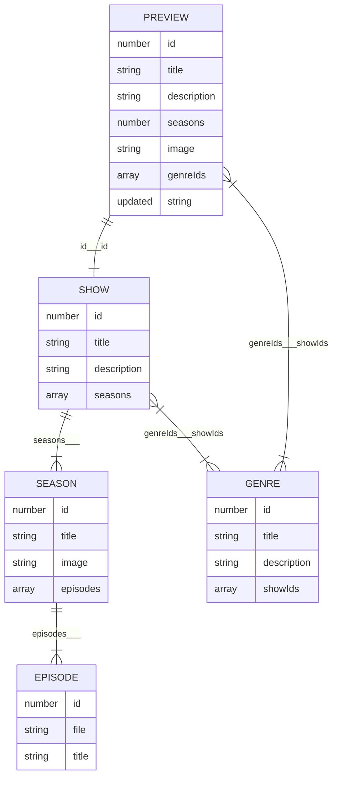

# Podcast App Template

A small podcating app template populated with dummy data to simulate the user experience 💿

Loom presentation [https://www.loom.com/share/64a5e1e990f04d77b34357c25b8178d7?sid=575a04d2-7d4b-4fe0-ba94-70da7e067987]

<!-- omit in toc -->

**Table of Contents**

- [🤖 Technology](#-technology)
- [📦Data](#data)
  - [Relationships](#relationships)
  - [Endpoints](#endpoints)
  - [Genre Titles](#genre-titles)
- [🧑 Instructions](#instructions)

## 🤖 Technology

- React
- Typescript
- Various third party libraries

Coded in VS Code

## 📦Data

**Data consists of three basic semantic units**

- `SHOW`: A specific podcast that contains a single or several `SEASON`
- `SEASON`: A collection of `EPISODE` released across a specific timespan
- `EPISODE`: Corresponds to a specific MP3 file that user can listen

However, the following information is also exposed via the API

- `PREVIEW`: A summarised version of a `SHOW` that only contains basic information. Usually exposed when an array of different `SHOW` information is requested.
- `GENRE`: Information related to a (one of many) genres that can be assigned to a `SHOW`

### Relationships

The following chart indicates the relations between units of data. It uses Entity Relationship mapping. In order to understand the meaning of symbols in the chart please read [the overview on the Mermaid.js documentation](https://mermaid.js.org/syntax/entityRelationshipDiagram.html).

Note that the text between the units indicates what properties map to one another. It is separated by means of three underscores (`___`). The value before the underscores is the mapping from the parent object, whereas the values after the underscore is the mapping from the child object.

_Note that is some cases there is no way to infer the parent from the child itself , in those cases just the parent map is noted, with no value after the underscores_.

### Endpoints

Data can be called via a `fetch` request to the following three endpoints. Note that there is not always a one-to-one mapping between endpoints and actual data structures. Also note that **\*`<ID>`** indicates where the dynamic ID for the requested item should be placed. For example: `[https://podcast-api.netlify.app/genre/3](https://podcast-api.netlify.app/genre/3)`\*

| URL                                          |                                                                                        |
| -------------------------------------------- | -------------------------------------------------------------------------------------- |
| `https://podcast-api.netlify.app`            | Returns an array of PREVIEW                                                            |
| `https://podcast-api.netlify.app/genre/<ID>` | Returns a GENRE object                                                                 |
| `https://podcast-api.netlify.app/id/<ID>`    | Returns a SHOW object with several SEASON and EPISODE objects directly embedded within |

### Genre Titles

Since genre information is only exposed on `PREVIEW` by means of the specific `GENRE` id, the following mapping has been included in the code itself:

| ID  | Title                    |
| --- | ------------------------ |
| 1   | Personal Growth          |
| 2   | Investigative Journalism |
| 3   | History                  |
| 4   | Comedy                   |
| 5   | Entertainment            |
| 6   | Business                 |
| 7   | Fiction                  |
| 8   | News                     |
| 9   | Kids and Family          |

## 🧑 Instructions

### Local Environment

- Clone repo locally into IDE of choice
- In the terminal, navigate to the project directory
- Type `npm i` to install dependencies
- Type `npm run dev` to open development server and open in browser

### Internet Browser

- Type `https://podcast-app-sibulele-ngada.netlify.app/` in the URL bar

#### Using the app

##### Home Page

- Carousel shows recommended shows at random
- Filter and search through shows via genre filter or search bar or both
- Sort results alphabetically or by date updated
- Click on any preview card to view show details

##### Show Page

- Show title and description at the top
- Seasons loaded with images
- Click on any season card to view episodes
- Episodes will appear on the same page below the list of seasons
- Click play to select episode and play from audio player
- Click favourite to add to favourites

##### Favourites Page

- Sort by show title or date updated
- Click play to select episode and play from audio player
- Click remove to delete a single episode from favourites
- Click clear to remove all favourites
